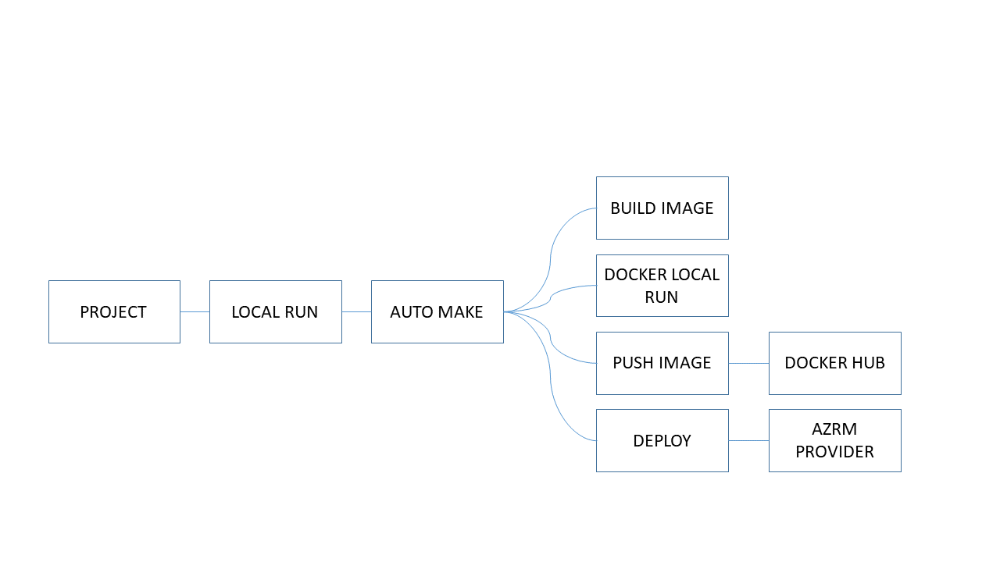

# Challenge
_Automation solution for deployment of the static site._

                                                                    
> ## What we're using in the project:

> * Github Actions (In progress);
> * Terraform tools; 🚀
> * Docker tools;
> * K8S in AKS (Backlog);
> * Azure Container Instance;
> * Helm (Backlog); 🥰

## Please make sure that your environment meets these pre-reqs:

* [Docker](https://hub.docker.com/editions/community/docker-ce-desktop-windows) installed;
* [Terraform CLI](https://www.terraform.io/downloads.html) installed;

## Quickstart

_You can run this project in your local environment._

__Local Executing__

_1. Clone this project;_

_2. Executing the command cli __make__;_

__Ready! That's about it!__ 🎖️

## Important

> If you to running local docker image, set **true** as  value of the **RUN_CONTAINER** variable.

